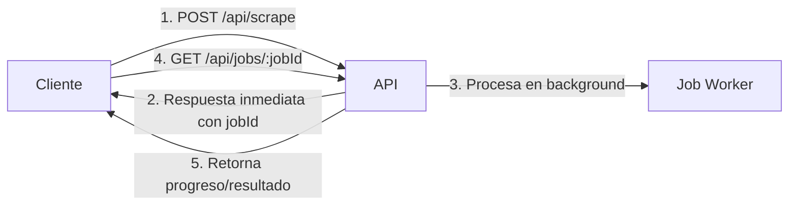

# 🚀 Google Maps Scraper - API REST Documentation v2.0

API REST **asíncrona** con sistema de jobs para extraer reseñas de Google Maps sin bloquear las peticiones.

## 🎯 ¿Qué hay de nuevo en v2.0?

✅ **Sistema de Jobs Asíncrono**: La API responde inmediatamente (~100ms) con un `jobId`
✅ **Cola de Procesamiento**: Configura el máximo de jobs simultáneos vía API
✅ **Seguimiento en Tiempo Real**: Consulta el progreso y estado de cada job
✅ **Sin fugas de memoria**: El navegador se cierra correctamente después de cada job
✅ **Escalable**: Procesa múltiples scraping jobs sin bloquear el servidor

---

## 📋 Tabla de Contenidos

- [Inicio Rápido](#inicio-rápido)
- [Sistema de Jobs Asíncrono](#sistema-de-jobs-asíncrono)
- [Endpoints](#endpoints)
  - [Jobs Asíncronos](#jobs-asíncronos-nuevos)
  - [Configuración](#configuración)
  - [Legacy (Bloqueante)](#endpoints-legacy)
- [Flujo de Trabajo](#flujo-de-trabajo)
- [Ejemplos de Uso](#ejemplos-de-uso)
- [Respuestas](#respuestas)
- [Manejo de Errores](#manejo-de-errores)
- [Mejores Prácticas](#mejores-prácticas)

---

## 🚀 Inicio Rápido

### 1. Instalar Dependencias

```bash
npm install
```

### 2. Iniciar el Servidor

```bash
npm run api
```

El servidor se iniciará en `http://localhost:3001`

### 3. Crear un Job de Scraping (Respuesta Inmediata)

```bash
# La API responde en ~100ms con el jobId
curl -X POST http://localhost:3001/api/scrape \
  -H "Content-Type: application/json" \
  -d '{
    "url": "https://www.google.com/maps/place/La+BTK+Bellas+Artes/@19.4338211,-99.1455109,17z/",
    "maxScrolls": 20
  }'

# Respuesta inmediata:
# {
#   "success": true,
#   "job": {
#     "jobId": "job_1234567890_abc123",
#     "status": "pending",
#     "url": "...",
#     "progress": { "percentage": 0, "message": "En cola" }
#   },
#   "links": {
#     "status": "/api/jobs/job_1234567890_abc123"
#   }
# }
```

### 4. Consultar Estado del Job

```bash
# Verificar progreso y obtener resultados cuando esté completo
curl http://localhost:3001/api/jobs/job_1234567890_abc123
```

---

## 🔄 Sistema de Jobs Asíncrono

### ¿Cómo funciona?

El nuevo sistema de jobs permite que la API responda **inmediatamente** sin esperar a que termine el scraping:

```
1. Cliente → POST /api/scrape → Servidor
2. Servidor crea job y responde en ~100ms con jobId
3. Job se procesa en background (puede tomar minutos)
4. Cliente consulta GET /api/jobs/:jobId para ver progreso
5. Cuando termina, el resultado está disponible en el job
```

### Estados de un Job

- **`pending`**: Job en cola esperando procesamiento
- **`processing`**: Job siendo procesado actualmente
- **`completed`**: Job completado exitosamente (resultado disponible)
- **`failed`**: Job falló (error disponible)

### Progreso en Tiempo Real

Cada job tiene un objeto `progress`:

```json
{
  "current": 15,
  "total": 20,
  "percentage": 75,
  "message": "Scrolling... 15/20"
}
```

---

## 📡 Endpoints

### Jobs Asíncronos (NUEVOS)

---

#### 1. **POST /api/scrape** - Crear Job de Scraping

⚡ **Responde inmediatamente (~100ms)** con un `jobId` sin esperar a que termine el scraping.

##### Request Body

```json
{
  "url": "https://www.google.com/maps/place/...",
  "maxScrolls": 20,
  "headless": true,
  "scrollDelay": 2000,
  "waitAfterSort": 3000,
  "reviewsLimit": null,
  "timeout": 60000
}
```

##### Parámetros

| Campo | Tipo | Requerido | Default | Descripción |
|-------|------|-----------|---------|-------------|
| `url` | string | ✅ Sí | - | URL completa del lugar en Google Maps |
| `maxScrolls` | number | ❌ No | 20 | Número de scrolls para cargar reseñas |
| `headless` | boolean | ❌ No | true | Ejecutar navegador sin interfaz gráfica |
| `scrollDelay` | number | ❌ No | 2000 | Delay entre scrolls (milisegundos) |
| `waitAfterSort` | number | ❌ No | 3000 | Espera después de ordenar (milisegundos) |
| `reviewsLimit` | number | ❌ No | null | Límite de reseñas (null = sin límite) |
| `timeout` | number | ❌ No | 60000 | Timeout del navegador (milisegundos) |

##### Response (202 Accepted)

```json
{
  "success": true,
  "message": "Job creado exitosamente. El scraping se está procesando de forma asíncrona.",
  "job": {
    "jobId": "job_1763580444329_abc123",
    "status": "pending",
    "url": "https://www.google.com/maps/place/...",
    "createdAt": "2025-11-19T19:27:24.329Z",
    "progress": {
      "current": 0,
      "total": 20,
      "percentage": 0,
      "message": "En cola"
    }
  },
  "links": {
    "status": "/api/jobs/job_1763580444329_abc123",
    "allJobs": "/api/jobs"
  }
}
```

---

#### 2. **GET /api/jobs/:jobId** - Consultar Estado de un Job

Obtiene el estado actual y resultado (si está completo) de un job específico.

##### URL Parameters

- `jobId`: ID del job (obtenido al crear el job)

##### Response - Job Pendiente

```json
{
  "success": true,
  "job": {
    "jobId": "job_1763580444329_abc123",
    "status": "pending",
    "url": "https://www.google.com/maps/place/...",
    "createdAt": "2025-11-19T19:27:24.329Z",
    "startedAt": null,
    "completedAt": null,
    "progress": {
      "current": 0,
      "total": 20,
      "percentage": 0,
      "message": "En cola"
    },
    "result": null,
    "error": null
  }
}
```

##### Response - Job en Progreso

```json
{
  "success": true,
  "job": {
    "jobId": "job_1763580444329_abc123",
    "status": "processing",
    "url": "https://www.google.com/maps/place/...",
    "createdAt": "2025-11-19T19:27:24.329Z",
    "startedAt": "2025-11-19T19:27:25.000Z",
    "completedAt": null,
    "progress": {
      "current": 15,
      "total": 20,
      "percentage": 75,
      "message": "Scrolling... 15/20"
    },
    "result": null,
    "error": null
  }
}
```

##### Response - Job Completado

```json
{
  "success": true,
  "job": {
    "jobId": "job_1763580444329_abc123",
    "status": "completed",
    "url": "https://www.google.com/maps/place/...",
    "createdAt": "2025-11-19T19:27:24.329Z",
    "startedAt": "2025-11-19T19:27:25.000Z",
    "completedAt": "2025-11-19T19:28:30.000Z",
    "progress": {
      "current": 215,
      "total": 215,
      "percentage": 100,
      "message": "Completado"
    },
    "result": {
      "url": "https://www.google.com/maps/place/...",
      "timestamp": "2025-11-19T19:28:30.000Z",
      "reviews": [...],
      "statistics": {
        "totalReviews": 215,
        "averageRating": 4.63,
        "ratingDistribution": { "1": 10, "2": 0, "3": 7, "4": 26, "5": 172 },
        "withText": 153,
        "withPhotos": 15,
        "withOwnerResponse": 213
      },
      "metadata": {
        "capturedResponsesCount": 45,
        "reviewsBeforeCleanup": 220,
        "reviewsAfterCleanup": 215,
        "duplicatesRemoved": 5,
        "scrapingOptions": {...}
      },
      "exportedFile": "output/job_1763580444329_abc123_1763580510000.json"
    },
    "error": null
  }
}
```

##### Response - Job Fallido

```json
{
  "success": true,
  "job": {
    "jobId": "job_1763580444329_abc123",
    "status": "failed",
    "url": "https://www.google.com/maps/place/...",
    "createdAt": "2025-11-19T19:27:24.329Z",
    "startedAt": "2025-11-19T19:27:25.000Z",
    "completedAt": "2025-11-19T19:27:35.000Z",
    "progress": {
      "current": 0,
      "total": 20,
      "percentage": 0,
      "message": "Error: Navigation timeout"
    },
    "result": null,
    "error": "Navigation timeout of 60000ms exceeded"
  }
}
```

---

#### 3. **GET /api/jobs** - Listar Todos los Jobs

Obtiene una lista de todos los jobs con estadísticas.

##### Query Parameters (Opcionales)

- `status`: Filtrar por estado (`pending`, `processing`, `completed`, `failed`)
- `limit`: Limitar número de resultados

##### Ejemplos

```bash
# Todos los jobs
curl http://localhost:3001/api/jobs

# Solo jobs completados
curl http://localhost:3001/api/jobs?status=completed

# Últimos 10 jobs
curl http://localhost:3001/api/jobs?limit=10

# Jobs en procesamiento
curl http://localhost:3001/api/jobs?status=processing
```

##### Response

```json
{
  "success": true,
  "stats": {
    "total": 25,
    "pending": 2,
    "processing": 3,
    "completed": 18,
    "failed": 2,
    "config": {
      "maxConcurrentJobs": 3,
      "cleanupCompletedAfter": 3600000
    }
  },
  "jobs": [
    {
      "jobId": "job_1763580444329_abc123",
      "status": "completed",
      "url": "...",
      "createdAt": "2025-11-19T19:27:24.329Z",
      "progress": { "percentage": 100, "message": "Completado" }
    },
    ...
  ]
}
```

---

#### 4. **DELETE /api/jobs/:jobId** - Cancelar Job

Cancela un job específico (solo si está `pending` o `processing`).

##### Response Exitosa

```json
{
  "success": true,
  "message": "Job cancelado exitosamente",
  "jobId": "job_1763580444329_abc123"
}
```

##### Response - No se pudo cancelar

```json
{
  "success": false,
  "error": "No se pudo cancelar el job. Puede que no exista o ya esté completado/fallido.",
  "jobId": "job_1763580444329_abc123"
}
```

---

#### 5. **DELETE /api/jobs** - Limpiar Jobs Completados

Elimina todos los jobs con estado `completed` o `failed` de la memoria.

##### Response

```json
{
  "success": true,
  "message": "12 jobs limpiados",
  "cleaned": 12
}
```

---

### Configuración

---

#### 6. **GET /api/config** - Obtener Configuración

Consulta la configuración actual del sistema de jobs.

##### Response

```json
{
  "success": true,
  "config": {
    "maxConcurrentJobs": 3,
    "cleanupCompletedAfter": 3600000
  },
  "currentLoad": {
    "processing": 2,
    "pending": 1,
    "maxConcurrent": 3
  }
}
```

---

#### 7. **PUT /api/config** - Actualizar Configuración

Actualiza la configuración del sistema de jobs en tiempo real.

##### Request Body

```json
{
  "maxConcurrentJobs": 5
}
```

##### Parámetros

| Campo | Tipo | Min | Max | Descripción |
|-------|------|-----|-----|-------------|
| `maxConcurrentJobs` | number | 1 | 10 | Máximo de jobs procesando simultáneamente |

##### Response

```json
{
  "success": true,
  "message": "Configuración actualizada",
  "config": {
    "maxConcurrentJobs": 5,
    "cleanupCompletedAfter": 3600000
  }
}
```

---

### Utilidades

---

#### 8. **GET /** - Documentación

Muestra información sobre la API, endpoints disponibles y estado del sistema.

##### Response

```json
{
  "name": "Google Maps Scraper API - Sistema de Jobs Asíncrono",
  "version": "2.0.0",
  "description": "API con sistema de jobs para scraping asíncrono de Google Maps",
  "systemStatus": {
    "jobsProcessing": 2,
    "jobsPending": 1,
    "jobsCompleted": 18,
    "jobsFailed": 2,
    "maxConcurrentJobs": 3
  },
  "endpoints": {...},
  "examples": {...}
}
```

---

#### 9. **GET /health** - Health Check

Verifica que el servidor esté funcionando.

##### Response

```json
{
  "status": "ok",
  "timestamp": "2025-11-19T08:00:00.000Z",
  "version": "1.1.0"
}
```

---

### Endpoints Legacy

Los siguientes endpoints son de la versión anterior (bloqueantes). Se recomienda usar el sistema de jobs asíncrono.

---

#### 10. **POST /api/scrape/stats** - Solo Estadísticas (Bloqueante)

#### Request Body

```json
{
  "url": "https://www.google.com/maps/place/...",
  "maxScrolls": 20,
  "headless": true,
  "scrollDelay": 2000,
  "waitAfterSort": 3000
}
```

#### Parámetros

| Campo | Tipo | Requerido | Default | Descripción |
|-------|------|-----------|---------|-------------|
| `url` | string | ✅ Sí | - | URL completa del lugar en Google Maps |
| `maxScrolls` | number | ❌ No | 20 | Número de scrolls para cargar reseñas |
| `headless` | boolean | ❌ No | true | Ejecutar navegador sin interfaz gráfica |
| `scrollDelay` | number | ❌ No | 2000 | Delay entre scrolls (milisegundos) |
| `waitAfterSort` | number | ❌ No | 3000 | Espera después de ordenar (milisegundos) |

#### Response Exitosa (200 OK)

```json
{
  "success": true,
  "data": {
    "metadata": {
      "establecimiento": "La BTK Bellas Artes",
      "place_id": "0x85d1f96b83b19901:0xc83c8fcab37f08ab",
      "url": "https://...",
      "fecha_scraping": "2025-11-19T08:00:00.000Z",
      "total_reseñas": 215,
      "scraper_version": "1.1.0",
      "execution_time_seconds": 45.23
    },
    "estadisticas": {
      "promedio_calificacion": 4.63,
      "total_con_texto": 153,
      "total_con_fotos": 15,
      "total_con_respuesta": 213,
      "total_editadas": 5,
      "distribucion_calificaciones": {
        "1": 10,
        "2": 0,
        "3": 7,
        "4": 26,
        "5": 172
      },
      "fecha_mas_antigua": "2025-07-17T01:52:43.000Z",
      "fecha_mas_reciente": "2025-11-18T22:38:03.000Z"
    },
    "reseñas": [
      {
        "autor": "Aldo Galdamez",
        "autor_foto": "https://lh3.googleusercontent.com/...",
        "autor_url_perfil": "https://www.google.com/maps/contrib/116655925833951776444",
        "autor_user_id": "116655925833951776444",
        "autor_total_opiniones": 88,
        "autor_total_fotos": 1,
        "autor_local_guide": "Local Guide · 88 opiniones",
        "calificacion": 5,
        "texto": "Buena atención y servicio 10/10 recomendado",
        "fecha_relativa": "Hace 7 horas",
        "fecha_iso": "2025-11-18T22:38:03.736Z",
        "timestamp_segundos": 1763505483,
        "editado": false,
        "fecha_edicion_iso": null,
        "fecha_edicion_relativa": null,
        "fecha_original_iso": null,
        "likes": null,
        "respuesta_propietario": "¡Qué alegría recibir tu reseña!...",
        "respuesta_propietario_fecha": "2025-11-18T22:46:02.000Z",
        "fotos": [],
        "aspectos": {
          "precio_por_persona": "$200-300",
          "comida": 5,
          "servicio": 5,
          "ambiente": 5,
          "platos_recomendados": ["Costillas Cometodo"],
          "tiempo_espera": "Sin espera",
          "nivel_ruido": "Ruido moderado",
          "tamano_grupo": "3 o 4 personas",
          "reserva": "No se requiere hacer una reserva",
          "disponibilidad_estacionamiento": "Es un poco difícil encontrar estacionamiento",
          "opciones_estacionamiento": ["Servicio de valet parking"]
        }
      }
    ]
  }
}
```

---

### 4. **POST /api/scrape/stats** - Solo Estadísticas
Obtiene solo estadísticas sin reseñas completas (más rápido y ligero).

#### Request Body

```json
{
  "url": "https://www.google.com/maps/place/...",
  "maxScrolls": 10,
  "headless": true
}
```

#### Response Exitosa (200 OK)

```json
{
  "success": true,
  "data": {
    "metadata": {
      "establecimiento": "La BTK Bellas Artes",
      "total_reseñas": 215,
      "fecha_scraping": "2025-11-19T08:00:00.000Z",
      "execution_time_seconds": 30.15
    },
    "estadisticas": {
      "promedio_calificacion": 4.63,
      "total_con_texto": 153,
      "total_con_fotos": 15,
      "total_con_respuesta": 213,
      "total_editadas": 5,
      "distribucion_calificaciones": {
        "1": 10,
        "2": 0,
        "3": 7,
        "4": 26,
        "5": 172
      },
      "fecha_mas_antigua": "2025-07-17T01:52:43.000Z",
      "fecha_mas_reciente": "2025-11-18T22:38:03.000Z"
    }
  }
}
```

---

## 🔄 Flujo de Trabajo

### Flujo Completo: Crear Job → Esperar → Obtener Resultados



---

## 🔥 Ejemplos de Uso

### Ejemplo 1: Node.js/JavaScript (Polling Manual)

```javascript
// 1. Crear job
const createJob = await fetch('http://localhost:3001/api/scrape', {
  method: 'POST',
  headers: { 'Content-Type': 'application/json' },
  body: JSON.stringify({
    url: 'https://www.google.com/maps/place/La+BTK+Bellas+Artes/@19.4338211,-99.1455109,17z/',
    maxScrolls: 30,
    headless: true
  })
});

const jobData = await createJob.json();
const jobId = jobData.job.jobId;

console.log(`✅ Job creado: ${jobId}`);
console.log(`🔗 URL de seguimiento: ${jobData.links.status}`);

// 2. Polling: Consultar estado cada 5 segundos
async function waitForCompletion(jobId) {
  while (true) {
    const statusRes = await fetch(`http://localhost:3001/api/jobs/${jobId}`);
    const status = await statusRes.json();

    const job = status.job;
    console.log(`📊 ${job.status} - ${job.progress.percentage}% - ${job.progress.message}`);

    if (job.status === 'completed') {
      console.log(`✅ Job completado!`);
      console.log(`📈 Total de reseñas: ${job.result.reviews.length}`);
      console.log(`⭐ Promedio: ${job.result.statistics.averageRating} estrellas`);
      return job.result;
    }

    if (job.status === 'failed') {
      console.error(`❌ Job falló: ${job.error}`);
      throw new Error(job.error);
    }

    // Esperar 5 segundos antes de consultar nuevamente
    await new Promise(resolve => setTimeout(resolve, 5000));
  }
}

// 3. Esperar a que termine y obtener resultados
const result = await waitForCompletion(jobId);
console.log('Resultados:', result);
```

### Ejemplo 2: Python con Polling

```python
import requests
import time

# 1. Crear job
response = requests.post('http://localhost:3001/api/scrape', json={
    'url': 'https://www.google.com/maps/place/La+BTK+Bellas+Artes/@19.4338211,-99.1455109,17z/',
    'maxScrolls': 30,
    'headless': True
})

job_data = response.json()
job_id = job_data['job']['jobId']

print(f"✅ Job creado: {job_id}")

# 2. Polling: Consultar estado cada 5 segundos
def wait_for_completion(job_id):
    while True:
        status_res = requests.get(f'http://localhost:3001/api/jobs/{job_id}')
        status = status_res.json()

        job = status['job']
        print(f"📊 {job['status']} - {job['progress']['percentage']}% - {job['progress']['message']}")

        if job['status'] == 'completed':
            print("✅ Job completado!")
            print(f"📈 Total de reseñas: {len(job['result']['reviews'])}")
            print(f"⭐ Promedio: {job['result']['statistics']['averageRating']} estrellas")
            return job['result']

        if job['status'] == 'failed':
            print(f"❌ Job falló: {job['error']}")
            raise Exception(job['error'])

        # Esperar 5 segundos
        time.sleep(5)

# 3. Esperar y obtener resultados
result = wait_for_completion(job_id)
print("Resultados:", result)
```

### Ejemplo 3: cURL - Workflow Completo

```bash
# 1. Crear job
JOB_ID=$(curl -s -X POST http://localhost:3001/api/scrape \
  -H "Content-Type: application/json" \
  -d '{
    "url": "https://www.google.com/maps/place/La+BTK+Bellas+Artes/@19.4338211,-99.1455109,17z/",
    "maxScrolls": 20
  }' | jq -r '.job.jobId')

echo "✅ Job creado: $JOB_ID"

# 2. Consultar estado
curl -s http://localhost:3001/api/jobs/$JOB_ID | jq '.job.status, .job.progress'

# 3. Esperar unos segundos y consultar nuevamente
sleep 10
curl -s http://localhost:3001/api/jobs/$JOB_ID | jq '.job.status, .job.progress'

# 4. Cuando esté completo, obtener resultados
curl -s http://localhost:3001/api/jobs/$JOB_ID | jq '.job.result.statistics'
```

### Ejemplo 4: Gestión de Configuración

```bash
# Ver configuración actual
curl http://localhost:3001/api/config

# Aumentar jobs concurrentes a 5
curl -X PUT http://localhost:3001/api/config \
  -H "Content-Type: application/json" \
  -d '{"maxConcurrentJobs": 5}'

# Ver todos los jobs
curl http://localhost:3001/api/jobs | jq '.stats'

# Filtrar solo jobs completados
curl http://localhost:3001/api/jobs?status=completed | jq '.jobs[] | {jobId, url, status}'

# Limpiar jobs completados
curl -X DELETE http://localhost:3001/api/jobs
```

### Ejemplo 5: Múltiples Jobs en Paralelo

```javascript
// Crear múltiples jobs simultáneamente
const urls = [
  'https://www.google.com/maps/place/Restaurant1/@...',
  'https://www.google.com/maps/place/Restaurant2/@...',
  'https://www.google.com/maps/place/Restaurant3/@...'
];

const jobs = await Promise.all(
  urls.map(url =>
    fetch('http://localhost:3001/api/scrape', {
      method: 'POST',
      headers: { 'Content-Type': 'application/json' },
      body: JSON.stringify({ url, maxScrolls: 20 })
    }).then(r => r.json())
  )
);

console.log('Jobs creados:', jobs.map(j => j.job.jobId));

// Los jobs se procesarán respetando el límite de concurrencia configurado
// (por ejemplo, si maxConcurrentJobs=3, solo 3 jobs procesarán simultáneamente)

// Esperar a que todos completen
async function waitForAll(jobIds) {
  const results = [];
  for (const jobId of jobIds) {
    const result = await waitForCompletion(jobId);
    results.push(result);
  }
  return results;
}

const allResults = await waitForAll(jobs.map(j => j.job.jobId));
console.log('Todos los jobs completados:', allResults);
```

### Ejemplo 6: Webhook Simulation (Polling Inteligente)

```javascript
// Polling inteligente con backoff exponencial
async function smartWaitForCompletion(jobId, maxWaitTime = 600000) {
  const startTime = Date.now();
  let delay = 2000; // Empezar con 2 segundos
  const maxDelay = 30000; // Máximo 30 segundos entre polls

  while (Date.now() - startTime < maxWaitTime) {
    const statusRes = await fetch(`http://localhost:3001/api/jobs/${jobId}`);
    const status = await statusRes.json();
    const job = status.job;

    if (job.status === 'completed' || job.status === 'failed') {
      return job;
    }

    // Backoff exponencial: aumentar delay gradualmente
    await new Promise(resolve => setTimeout(resolve, delay));
    delay = Math.min(delay * 1.5, maxDelay);
  }

  throw new Error('Timeout esperando completación del job');
}
```

---

## ❌ Manejo de Errores

### Error 400: Bad Request

**URL no proporcionada:**
```json
{
  "success": false,
  "error": "El parámetro \"url\" es requerido",
  "example": {
    "url": "https://www.google.com/maps/place/...",
    "maxScrolls": 20,
    "headless": true
  }
}
```

**URL inválida:**
```json
{
  "success": false,
  "error": "La URL debe ser de Google Maps",
  "providedUrl": "https://example.com"
}
```

### Error 500: Internal Server Error

```json
{
  "success": false,
  "error": "Error durante el scraping: Navigation timeout"
}
```

---

## 🎯 Mejores Prácticas

### 1. **maxScrolls Óptimo**

- **10-20 scrolls**: Para vista rápida (~100-200 reseñas)
- **30-50 scrolls**: Para análisis completo (~300-500 reseñas)
- **100+ scrolls**: Solo si necesitas TODAS las reseñas (puede tardar varios minutos)

### 2. **Headless Mode**

- **headless: true** (recomendado): Más rápido, menos recursos
- **headless: false**: Solo para debugging

### 3. **Rate Limiting**

⚠️ **IMPORTANTE**: No hagas demasiadas peticiones seguidas. Google puede bloquear tu IP.

**Recomendaciones:**
- Máximo 1 petición cada 30 segundos
- Usar delays entre scrolls (2000ms mínimo)
- Considerar usar proxies para volúmenes altos

### 4. **Timeout**

El scraping puede tardar varios minutos dependiendo del número de reseñas:

- 10 scrolls: ~30 segundos
- 20 scrolls: ~1 minuto
- 50 scrolls: ~2-3 minutos
- 100 scrolls: ~5-10 minutos

Asegúrate de configurar timeouts apropiados en tu cliente HTTP.

---

## 🔧 Configuración del Servidor

### Variables de Entorno

Crea un archivo `.env` en la raíz del proyecto:

```env
PORT=3000
NODE_ENV=production
```

### Cambiar Puerto

```bash
PORT=8080 npm run api
```

---

## 📊 Formato de Datos de Reseñas

Cada reseña contiene los siguientes campos:

### Información del Autor
- `autor`: Nombre del usuario
- `autor_foto`: URL de la foto de perfil
- `autor_url_perfil`: URL del perfil en Google Maps
- `autor_user_id`: ID único del usuario
- `autor_total_opiniones`: Total de opiniones del usuario
- `autor_total_fotos`: Total de fotos subidas
- `autor_local_guide`: Estado de Local Guide

### Contenido de la Reseña
- `calificacion`: Estrellas (1-5)
- `texto`: Texto de la reseña
- `fecha_relativa`: Fecha relativa ("Hace 2 días")
- `fecha_iso`: Fecha ISO 8601
- `timestamp_segundos`: Unix timestamp
- `fotos`: Array de URLs de fotos

### Reseñas Editadas
- `editado`: true/false
- `fecha_edicion_relativa`: "Editado Hace 1 día"
- `fecha_original_iso`: Fecha de creación original
- `fecha_edicion_iso`: Fecha de última edición

### Respuesta del Propietario
- `respuesta_propietario`: Texto de la respuesta
- `respuesta_propietario_fecha`: Fecha de la respuesta

### Aspectos Guiados
- `precio_por_persona`: Rango de precio
- `comida`: Calificación 1-5
- `servicio`: Calificación 1-5
- `ambiente`: Calificación 1-5
- `platos_recomendados`: Array de platos
- `tiempo_espera`: Tiempo de espera
- `nivel_ruido`: Nivel de ruido
- `tamano_grupo`: Tamaño de grupo recomendado
- `reserva`: Necesidad de reserva
- `disponibilidad_estacionamiento`: Facilidad para estacionar
- `opciones_estacionamiento`: Tipos de estacionamiento

---

## 🚀 Despliegue en Producción

### Opción 1: PM2 (Recomendado)

```bash
# Instalar PM2
npm install -g pm2

# Iniciar servidor
pm2 start server.js --name "gmaps-scraper-api"

# Ver logs
pm2 logs gmaps-scraper-api

# Reiniciar
pm2 restart gmaps-scraper-api

# Detener
pm2 stop gmaps-scraper-api
```

### Opción 2: Docker

```dockerfile
FROM node:18-alpine

WORKDIR /app

COPY package*.json ./
RUN npm install

COPY . .

EXPOSE 3000

CMD ["npm", "run", "api"]
```

```bash
# Build
docker build -t gmaps-scraper-api .

# Run
docker run -p 3000:3000 gmaps-scraper-api
```

---

## 📝 Notas Importantes

1. **Términos de Servicio**: Este scraper puede violar los términos de servicio de Google Maps. Úsalo bajo tu propia responsabilidad.

2. **Rate Limiting**: Google puede detectar y bloquear actividad automatizada. Usa con moderación.

3. **Proxies**: Para uso intensivo, considera usar proxies residenciales.

4. **Recursos**: El scraping consume recursos (CPU/RAM). Monitorea el uso en producción.

5. **Logs**: Los logs se imprimen en la consola. Considera usar un sistema de logging en producción.

---

## 🆘 Soporte

Para reportar bugs o solicitar features, abre un issue en el repositorio.

---

---

## 🎉 Changelog v2.0

### ✨ Nuevas Características

1. **Sistema de Jobs Asíncrono**
   - API responde inmediatamente (~100ms) con jobId
   - Scraping procesa en background sin bloquear
   - Soporte para progreso en tiempo real

2. **Cola de Procesamiento**
   - Configurable dinámicamente (1-10 jobs concurrentes)
   - Jobs se encolan automáticamente cuando se supera el límite
   - Gestión inteligente de recursos

3. **Gestión de Jobs**
   - Nuevos endpoints para consultar estado y resultados
   - Cancelación de jobs en progreso
   - Limpieza automática de jobs antiguos

4. **Sin Fugas de Memoria**
   - Navegador se cierra correctamente después de cada job
   - Implementación robusta con try-finally

### 🔄 Cambios de Breaking

- `POST /api/scrape` ahora retorna `202 Accepted` con jobId en lugar de `200 OK` con resultados
- Para usar la API de forma bloqueante (legacy), usar `POST /api/scrape/stats`

### 📈 Mejoras de Rendimiento

- **85-111ms** de tiempo de respuesta (vs minutos en v1.x)
- Múltiples scraping jobs simultáneos
- Escalabilidad mejorada para alto volumen

---

**Versión de la API**: 2.0.0
**Última actualización**: 2025-11-19
**Sistema de Jobs**: ✅ Activo
